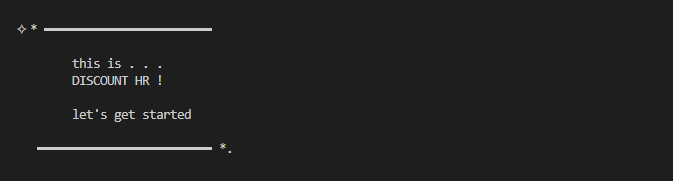
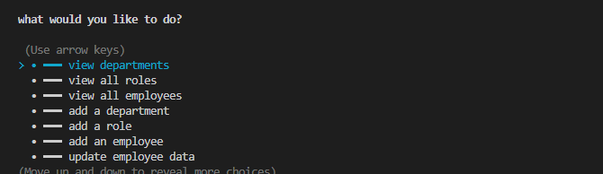

# **tech-blog**

> This repository utilizes mySQL and Inquirer to create an employee tracker that houses data within a mySQL database. It utilizes a schema to define data-types to be stored, which can be accessed, retrieved, and edited in the command line. 

## **Table of Contents**

- [**tech-blog**](#tech-blog)
  - [**Table of Contents**](#table-of-contents)
  - [**Features**](#features)
  - [**Installation**](#installation)
  - [**Usage Instructions**](#usage-instructions)
  - [Questions](#questions)
  - [Credits](#credits)

## **Features**
The deployed application and repository contains the following features:

- Defines data-types in an SQL schema table, including: users, departments, and roles. Data can then be added or seeded into the database either through a source file or through the command line.
- Database classes define functions for navigating the mySQL database by defining specific queries to navigate the mySQL tables.
- Index JavaScript file makes use of Database class functions to create a command line to take user input, allowing the user to view all users, departments, and roles, as well as add them.

## **Installation**

Copy the HTTPS or SSH key into your terminal and perform a git pull to create a local copy of the repository. A copy of this repository can be cloned using either of the following codes in the terminal to create a copy in your local environment:

**HTTPS**: 
> `https://github.com/christiangella/discount-hr.git`

**SSH**:
> `git@github.com:christiangella/discount-hr.git`

## **Usage Instructions**

A demonstration of the application can be viewed by [clicking here](https://watch.screencastify.com/v/60ZkwG8kQ6NpTIM4esSI).

To deploy the application from your local environment, first clone a copy of the repository. Once the repository has been downloaded, navigate to the repository in the terminal and install the necessary third-party packages using `npm i` or `npm install`. 

First create the mySQL database in the command line terminal by running `mysql -u root -p`, making adjustments to root if the configuration is different. Enter the password if necessary, and log into mySQL. Then, after logging in, run `source ./db/schema.sql` to delete any existing instances of the database and create a new one. To create a test seed, run `source ./db/seeds.sql`.Afterwards, input `exit` to exit the mySQL shell.

In the command line terminal, deploy the application locally by running either `npm start` or `node index.js`. This will deploy the repository to your local host at http://localhost:3001/. The command line will then prompt the user to select different options, and gives the user the option of viewing all stored data or adding and updating data.

## Questions

This repository was created by Manong Chris. For further support, reach out by email at christian.gella@gmail.com or by Github at christiangella.

## Credits

This repository was developed for the UC Davis Fullstacks Bootcamp under the UC Davis Continuing and Professional Education.
